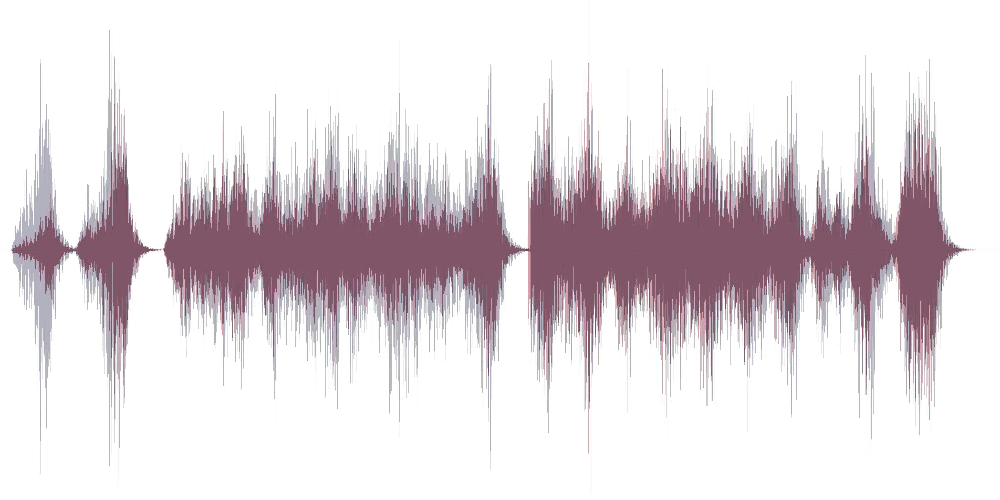

This document describes the ADP file format used in Arcturus.

## Contents

ADP files contain compressed audio samples for the game's background music tracks.

## Layout

### Versions

Each file encodes a sequence of interleaved stereo (i.e., two-channel) audio samples, preceded by a magic header:

```cpp title="ADP File Format (Arcturus)"
struct ArcturusADP {
    uint32_t StartingOffset;
    uint32_t NumSamplesPerSecond;
    uint32_t NumInterleavedAudioChannels;
    uint32_t AudioStreamSizeInBytes;
    uint8_t* CompressedAudioStream;
};
```

### Fields

#### StartingOffset

Appears to simply be the size of the header, which is the offset to the ADPCM-compressed audio stream. Always `16`.

#### NumSamplesPerSecond

The playback speed (technically: [sampling rate](<https://en.m.wikipedia.org/wiki/Sampling_(signal_processing)#Sampling_rate>)). Once decoded, this many samples should be rendered per second. Always `22050`, which matches the 44.1 kHz sampling rate typically used for [Audio CDs](https://en.m.wikipedia.org/wiki/Compact_Disc_Digital_Audio). Each `int16_t` sample takes up two bytes.

#### NumInterleavedAudioChannels

How many channels can be found in the ADPCM-encoded audio stream. Always `2` (for stereo = alternating left/right).

#### AudioStreamSizeInBytes

How many bytes can be extracted from the ADPCM-encoded audio stream. Represents the distance until `EOF`.

#### Compressed Audio Stream

ADPCM-encoded 4-bit audio samples. For stereo streams, each byte corresponds to a single (`LEFT`, `RIGHT`) audio sample.

## ADPCM Compression

ADP files contain audio samples that have been encoded with an implementation of the [ADPCM](https://en.wikipedia.org/wiki/Adaptive_differential_pulse-code_modulation) compression algorithm.

ADPCM is an audio compression scheme that works by predicting the shape of an encoded audio signal, the "waveform" - one per channel - based on an initial state (presumably, all zeroes in this case). It is adaptive in the sense that each new 4-bit sample modifies the state of the predictor and thereby influences how the remainder of the audio stream should be interpreted.

This means that even slight errors propagate and accumulate over time, leading to audible artifacts like white noise, crackling, unexpected volume changes, or other unpleasant disturbances in the output signal. For that reason, it is critical to get all of the details right (and, if you're implementing a decoder, take precautions to protect your hearing whilst debugging).

### IMA ADPCM Codec

There are many variants of the ADPCM algorithm. The one implemented in the game appears to be based on the official [IMA ADPCM specification](http://www.cs.columbia.edu/~hgs/audio/dvi/IMA_ADPCM.pdf). In this version, lookup tables were originally introduced to allow replacing expensive floating-point ops with bit-shifts and integer arithmetic. Unfortunately, this introduces a layer of indirection that may obscure the core idea behind the algorithm. It is however explained in the specification for the [Dialogic/OKI ADPCM](https://en.wikipedia.org/wiki/Dialogic_ADPCM) codec (archived [here](https://web.archive.org/web/20061118115218/http://www.salina.k-state.edu/faculty/tim/vox/dialogic_adpcm.pdf)).

Luckily, the IMA specification does include a reference implementation. From `6.2. 4-bit ADPCM to 16-bit Linear Decompression`:

```cpp title="Preinitialized variables"
 index = 0;
 stepsize = 7;
 /* output of ADPCM predictor */
 /* index into stepsizeTable */
 /* quantizer stepsize */
 indexTable[16] = {–1,–1,–1,–1, 2, 4, 6, 8, /* Table of index changes */
  –1,–1,–1,–1, 2, 4, 6, 8);
 stepsizeTable[89] = {7, 8, 9, 10, 11, 12, 13, /* quantizer lookup table */
 14, 16, 17, 19, 21, 23, 25, 28,
 31, 34, 37, 41, 45, 50, 55, 60,
66, 73, 80, 88, 97, 107, 118,
130, 143, 157, 173, 190, 209, 230,
253, 279, 307, 337, 371, 408, 449,
494, 544, 598, 658, 724, 796, 876,
963, 1060, 1166, 1282, 1411, 1552,
1707, 1878, 2066, 2272, 2499, 2749,
3024, 3327, 3660, 4026, 4428, 4871,
5358, 5894, 6484, 7132, 7845, 8630,
9493, 10442, 11487, 12635, 13899,
15289, 16818, 18500, 20350, 22385,
24623, 27086, 29794, 32767);
```

```cpp title="Calculation for each sample"
/* compute predicted sample estimate newSample */
 /* calculate difference = (originalSample + ½) * stepsize/4: */
 difference = 0;
 if (originalSample & 4)
 /* perform multiplication through repetitive addition */
 difference + = stepsize;
 if (originalSample & 2)
 difference + = stepsize >> 1;
 if (originalSample & 1)
 difference + = stepsize >> 2;
 /* (originalSample + ½) * stepsize/4 =originalSample * stepsize/4 + stepsize/8: */
 difference + = stepsize >> 3;
 if (originalSample & 8)
 /* account for sign bit */
 difference = –difference;
 /* adjust predicted sample based on calculated difference: */
 newSample + = difference;
 if (newSample > 32767)
 /* check for overflow */
 newSample = 32767;
 else if (newSample < –32768)
 newSample = –32768;
 /* 16-bit newSample can be stored at this point */
 /* compute new stepsize */
 /*adjust index into stepsize lookup table using originalSample: */
 index + = indexTable[originalSample];
 if (index < 0)
 /* check for index underflow */
 index = 0;
 else if (index > 88)
 index = 88;
 stepsize = stepsizeTable[index];
```

Note that the examples following this description aren't quite correct, and have therefore been omitted from this document.

## Open Questions

Several details still need to be investigated:

1. It's unclear whether the predictor is in fact seeded; it didn't seem to make a noticeable difference in my testing
2. Samples should be hard-clipped whenever they exceed the 16-bit range, although this will at times sound jarring
3. Compared to the MP3 version of the game's soundtrack, the ADP version generally seems inferior in quality
4. Whether or not the game modifies the samples before playing them back might be worth looking into as well
5. A side-by-side comparison for each track to the actual ingame audio (or YouTube videos/recordings) could help

It's possible to generate outputs that closely resemble the official OST waveform. However, a few discrepancies remain:


_IMA-decoded ADPCM waveform (red) overlaid with raw MP3 samples from the second OST music track, titled ["The Innocents"](https://www.youtube.com/watch?v=8GdjFGFGOBc)._

:::info
Waveform visualizations for other tracks can be found [here](https://valkyrie-realm.net/research/file-formats/adp/samples/). Generating them locally instead is highly recommended.
:::

Whether or not these discrepancies are solely due to the use of different compression schemes remains to be seen.
