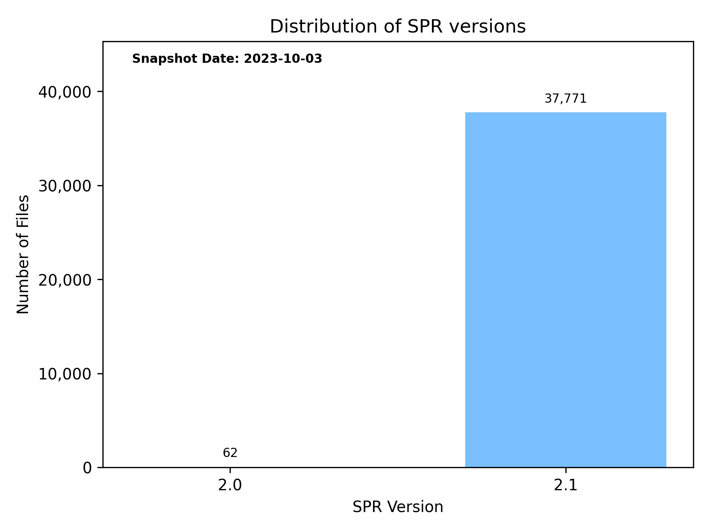

This document describes the SPR file format used in the Ragnarok Online client (and Arcturus).

## Contents

SPR files contain the following information:

- Sprites, icons, and other graphics rendered by the game (either inside the world or as part of the UI)
- Indexed-color bitmaps and their respective color palettes, here called the "BMP segment"
- Truecolor images with transparency values for each pixel, here called the "TGA segment"

The file contents can be interpreted as a [spritesheet](https://en.wikipedia.org/wiki/Texture_atlas) and combined with [ACT files](/file-formats/act) to implement animated sprites.

## Features

### Bitmap Color Palette

Instead of encoding the RGBA pixels directly, the BMP segment of the file uses a [color palette](<https://en.wikipedia.org/wiki/Palette_(computing)>) with up to 256 colors:

- In the image data, each byte corresponds to an entry in this lookup table
- Entry 0 is always the (transparent) background color, regardless of its alpha value
- Even if present, alpha values are otherwise not supported and should be ignored

The palette included in the SPR file is the default palette. It's possible to load in [PAL](/file-formats/pal) files to recolor a given sprite.

### Run-Length Encoding

Because most sprites include a significant number of (transparent) background pixels, later versions of the format employ a primitive compression scheme to reduce the number of identical palette indices that have to be stored in the BMP segment.

The method is chiefly known as [RLE](https://en.wikipedia.org/wiki/Run-length_encoding) because it works by encoding runs (here: of zero bytes, which refer to the palette index 0 - the transparent background color) into a two-byte shorthand: First, a zero-byte that indicates the start of a run, and then the number of encoded zero bytes. Decompression simply requires inserting the same number of zeroes into the output stream.

If that sounds confusing, here's some examples:

- If the image contained five background pixels, you'll see `00 05`, which stands for "emit zero, five times"
- The bytes `"ABC"` (`65 66 67`) are "decompressed" to the same sequence as there's no encoded run present
- A single zero byte must be encoded as `00 01` ("emit zero, one time") - meaning that `00 00` is not allowed

This feature isn't used for the truecolor (TGA) segments as pixels are stored in ABGR format, in which repetition is less common.

### Transparency

Alpha values in the BMP palette are completely ignored. RGBA colors will be stored raw and not premultiplied.

The color with palette index 0 should be considered the "background color". It must be cleared manually, though.

## Versions

The following SPR versions can be found in the kRO client's `data.grf` archive:

## Layout

### Version 1.1

This most basic variant only supports BMP sprites. It's used in [Arcturus](/arcturus), but not in any known version of the RO client.

|       Field        |  Offset  |  Length  |   Type   |                               Description                               |
| :----------------: | :------: | :------: | :------: | :---------------------------------------------------------------------: |
|      `Header`      |    0     |    2     | `string` |              `"SP"` as an ASCII-encoded, fixed-size string              |
|   `MinorVersion`   |    2     |    1     |  `byte`  |                         Versioning information                          |
|   `MajorVersion`   |    3     |    1     |  `byte`  |                         Versioning information                          |
| `BitmapImageCount` |    4     |    2     | `ushort` |              How many images are stored in the BMP segment              |
|  `BitmapSprites`   |    6     | variable | `array`  |    Indexed-color sprite images; pixels are stored as palette indices    |
|   `ColorPalette`   | variable |   1024   | `array`  | RGBA pixel colors (`byte` values); always stored at the end of the file |

#### Bitmap Sprites

This repeating structure contains the raw pixel data in the form of references to palette entries that need to be resolved.

|      Field       | Offset |  Length  |  Type   |                      Description                       |
| :--------------: | :----: | :------: | :-----: | :----------------------------------------------------: |
|   `ImageWidth`   |   0    |    2     | `short` |     The width of the sprite image, given in pixels     |
|  `ImageHeight`   |   2    |    2     | `short` |    The height of the sprite image, given in pixels     |
| `PaletteIndices` |   4    | variable | `array` | Array of indexed-color palette indices (`byte` values) |

A size of `-1, -1` (`FF FF FF FF`) indicates an invalid image, which consists of a single pixel that can (probably) be discarded.

### Version 2.0

This version adds the ability to store truecolor images (RGBA pixels with an alpha channel). It appears in RO and Arcturus.

|         Field         |  Offset  |  Length  |   Type   |                               Description                               |
| :-------------------: | :------: | :------: | :------: | :---------------------------------------------------------------------: |
|       `Header`        |    0     |    2     | `string` |              `"SP"` as an ASCII-encoded, fixed-size string              |
|    `MinorVersion`     |    2     |    1     |  `byte`  |                         Versioning information                          |
|    `MajorVersion`     |    3     |    1     |  `byte`  |                         Versioning information                          |
|  `BitmapImageCount`   |    4     |    2     | `ushort` |              How many images are stored in the BMP segment              |
| `TruecolorImageCount` |    6     |    2     | `ushort` |              How many images are stored in the TGA segment              |
|    `BitmapSprites`    |    8     | variable | `array`  |    Indexed-color sprite images; pixels are stored as palette indices    |
|  `TruecolorSprites`   | variable | variable | `array`  |     Truecolor sprite images; pixels are stored raw (in order ABGR)      |
|    `ColorPalette`     | variable |   1024   | `array`  | RGBA pixel colors (`byte` values); always stored at the end of the file |

#### Truecolor Sprites

This repeating structure contains the raw pixel data in an uncompressed form.

|     Field     | Offset |  Length  |  Type   |                   Description                   |
| :-----------: | :----: | :------: | :-----: | :---------------------------------------------: |
| `ImageWidth`  |   0    |    2     | `short` | The width of the sprite image, given in pixels  |
| `ImageHeight` |   2    |    4     | `short` | The height of the sprite image, given in pixels |
| `PixelBuffer` |   6    | variable | `array` |  Array of raw ABGR image data (`byte` values)   |

### Version 2.1

This version adds compression (via [RLE](#run-length-encoding)) for images in the BMP segment of the file. It's used in all modern RO clients.

#### Compressed Bitmap Sprites

The only difference here is that runs of zero palette indices (i.e., multiple background pixels) are RLE-compressed.

|           Field            | Offset |  Length  |   Type   |                         Description                          |
| :------------------------: | :----: | :------: | :------: | :----------------------------------------------------------: |
|        `ImageWidth`        |   0    |    2     | `short`  |        The width of the sprite image, given in pixels        |
|       `ImageHeight`        |   2    |    2     | `short`  |       The height of the sprite image, given in pixels        |
|   `CompressedBufferSize`   |   4    |    2     | `ushort` |       How many bytes to feed into the RLE decompressor       |
| `CompressedPaletteIndices` |   6    | variable | `array`  | RLE-compressed indexed-color palette indices (`byte` values) |

The size of the decompressed image is still `ImageWidth * ImageHeight`, but you must read `CompressedBufferSize` bytes only.
