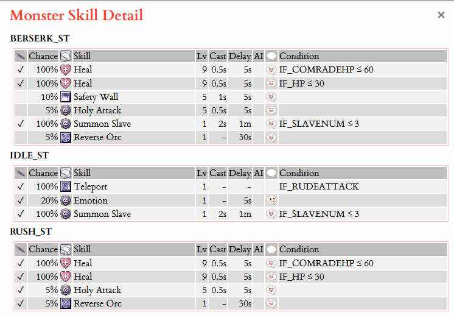

This document describes how Ragnarok Online's zone servers determine the behavior of AI-enabled actors in the game world.

## Model of AI Behavior

The behaviors of ingame actors can be sorted into a few basic categories:

- Movement: Random walks, following parents, and chasing targets
- Combat: Reacting to attacks/spellcasts, target selection (including AOI checks)
- Looting: Picking up items from the floor, and moving to an item's location

This kind of logic is represented by a set of state transitions, here called _AI preset_, and assigned to creatures. It can also be changed on the fly to enable more complex reactions and facilitate somewhat dynamic reactions to gameplay situations.

Then, there's two additional categories worth exploring separately:

- Skills: Abilities that are defined for each creature type, and specific to only it
- NPC Events: Unrelated to creatures, they're behind regular dialogs and player-NPC interactions

The first is implemented via a set of predefined rules making up the skill usage patterns for a given unit class (monster type), which is called the monster's _skillset_. Skills are then used based on the current state and probabilities for each configured event.

_NPC events_ are a special case and only apply to regular (non-creature) NPCs, which are technically using the same framework but with fewer, specialized states and no transitions. The state of NPC actors doesn't really change, so they're always "Idle".

## AI State Changes

A finite state machine (FSM) represents the behavior of each actor. The state of this machine changes based on inputs provided by ingame events, which the zone server feeds into the FSM as part of its [World State Update](02-world-state-updates.md#simulation-steps) loop. After processing an input, the server emits another event as the FSM's output, to be processed in the same update loop - or possibly in the next iteration.

### List of AI States

The list of supported AI states is short, but their interpretation isn't always straight-forward:

|      State ID      |  Interpretation   |                                                Description                                                |
| :----------------: | :---------------: | :-------------------------------------------------------------------------------------------------------: |
|   `ABNORMAL_ST`    |      Status       |                 Impacted by loss of control effects that prevent it from acting normally                  |
|     `ANGRY_ST`     |      Enraged      | Aggressively attacking or chasing target, using an alternate behavior set (switches after being attacked) |
|    `BERSERK_ST`    |     Attacking     |                               In range and actively attacking their target                                |
|     `DEAD_ST`      |       Dead        |                          Currently removed from the map (inactive until respawn)                          |
| `FOLLOW_SEARCH_ST` | Scanning (Follow) |                Seeking new targets in the area of interest, while following a parent unit                 |
|    `FOLLOW_ST`     |     Following     |                          Moving to a new location, while following a parent unit                          |
|     `IDLE_ST`      |       Idle        |                               No action is currently in progress (default)                                |
|   `MOVEITEM_ST`    |      Looting      |                            Moving towards an item, with the intent to loot it                             |
|     `RMOVE_ST`     |      Walking      |                                 Moving (random walk, when not in combat)                                  |
|     `RUSH_ST`      |     Pursuing      |                       Chasing down a target (player), with the intent to attack it                        |
|    `SEARCH_ST`     |     Scanning      |                            Monitoring the area of interest to find new targets                            |

_Source: [Kokotewa's RO database](https://cp.kokotewa.com/resources/database) (contains the AI states, presets, and transitions for any given creature)_

Some more details about the (somewhat confusing) `ANGRY_ST` state:

> Angry: These mobs are "hyper-active". Apart from "chase"/"attack", they have the states "follow"/"angry". Once hit, they stop using these states and use the normal ones. The new states are used to determine a different skill-set for their "before attacked" and "after attacked" states. Also, when "following", they automatically switch to whoever character is closest.

_Source: [Hercules documentation](https://github.com/HerculesWS/Hercules/blob/7b77b4e549c091580f43b61a755d6edbda611c60/doc/mob_db_mode_list.md) (also contains other information about the AI system)_

## Input and Output Events

:::caution

This section contains unverified information and/or speculation. It may or may not be completely wrong.

:::

AI state changes are triggered by certain game events, which serve as _input_ to the underlying FSM. Similarly, state transitions emit _output_ events which can then influence the game world. The exact order this happens isn't entirely clear, but there's some evidence the output events are emitted some time _before_ the resulting state transition is executed:

> The term spawn is misleading as monsters don’t technically die, rather monsters are temporarily removed from the map. This is important because when a monster is returned to the map the monster AI will remain in the previous state, e.g. if a monster is aggressive to a player, and were to respawn near that player, it will remain aggressive towards that player. While this is rarely encountered due to a combination of horizontal/vertical position variance and non-zero regeneration timers it does explain otherwise inexplicable behavior, e.g. an ordinarily passive monster respawning with aggressive behavior.

Source: [Kokotewa's blog](https://blog.kokotewa.com/monster-spawns/)

For any of that to happen, it would be necessary for state changes to have the ability to override each other... like so:

1. Creature is "killed" (removed from map) and flagged as "dead" (regenerating)
2. The respawn timer expires, which triggers the regeneration logic
3. The creature is revived in its original AI state (output event triggers here)
4. **It "spawns" next to a player, still in its original AI state**
5. The player's proximity triggers the appropriate input event
6. The creature immediately attacks the player, switching AI states
7. The "idle" output state is never reached, because another transition overrode it

If there was no player to attack when the creature respawns, it should follow that instead of 5 to 7, the output state will then be set (after the "scanning for targets" step). Since anecdotal evidence for such situations is plentiful, that's probably what's going on in the background. This is of course mere conjecture, but there's no other explanation for the aforementioned phenomenon.

### List of Input Events

These are the ingame events that can trigger FSM state transitions:

|              ID              |                                         Description                                          | Scope |
| :--------------------------: | :------------------------------------------------------------------------------------------: | :---: |
|       `ARENASTART_IN`        |                           Some "arena" (PVP) event was started (?)                           |  NPC  |
|     `ARRIVEDAT_ITEM_IN`      |       The creature arrived at the location of the item it is currently trying to loot        |  MOB  |
|        `ATTACKED_IN`         |                           The creature was attacked (by a player?)                           |  MOB  |
|     `CHANGE_NORMALST_IN`     |                  All loss of control effects were removed from the creature                  |  MOB  |
|  `CHARACTER_ATTACKSIGHT_IN`  |                 A player entered the creature's attack range (on their own?)                 |  MOB  |
| `CHARACTER_INATTACKSIGHT_IN` |            The creature reached the targeted unit and is now within attack range             |  MOB  |
|    `CHARACTER_INSIGHT_IN`    |                       A player entered the creature's area of interest                       |  MOB  |
|          `CLICK_IN`          |                   The NPC was clicked (player started interacting with it)                   |  NPC  |
|    `DEADSTATE_TIMEOUT_IN`    |                        The respawn timer for the creature has elapsed                        |  MOB  |
|   `DESTINATION_ARRIVED_IN`   |      The creature has arrived at the target location of its most recent movement action      |  MOB  |
|   `ENEMY_INATTACKSIGHT_IN`   |                  The targeted player is within the creature's attack range                   |  MOB  |
|  `ENEMY_OUTATTACKSIGHT_IN`   | The targeted player is outside the creature's attack range (but within its area of interest) |  MOB  |
|     `ENEMY_OUTSIGHT_IN`      |                 The targeted player has left the creature's area of interest                 |  MOB  |
|    `ENERGY_RECHARGED_IN`     |                           The creature's power has replenished (?)                           |  MOB  |
|     `FRIEND_ATTACKED_IN`     |              An allied creature was attacked in the creature's area of interest              |  MOB  |
| `G_CHARACTER_ATTACKSIGHT_IN` |                     A player entered the WOE guardian's attack range (?)                     |  MOB  |
|   `G_CHARACTER_INSIGHT_IN`   |                   A player entered the WOE guardian's area of interest (?)                   |  MOB  |
|      `ITEM_INSIGHT_IN`       |               A lootable item was detected in the creature's area of interest                |  MOB  |
|   `LOWERLEVEL_INSIGHT_IN`    |   A viable target (low level player?) has been detected in the creature's area of interest   |  MOB  |
|      `MAGIC_LOCKON_IN`       |                       A spellcast targeting the creature was detected                        |  MOB  |
|     `MILLI_ATTACKED_IN`      |                   The creature was attacked (by a player?) in melee range                    |  MOB  |
|      `MOVE_END_POS_IN`       |                  The creature has arrived (after moving to a new location)                   |  MOB  |
|     `MOVE_RANDOM_END_IN`     |                     The random movement delay timer is about to be reset                     |  MOB  |
|       `MOVE_START_IN`        |                   The creature is about to start moving to a new location                    |  MOB  |
|    `MYOWNER_ATTACKED_IN`     |                             The unit's parent unit was attacked                              |  MOB  |
|    `MYOWNER_OUTSIGHT_IN`     |                       The unit's parent has left the area of interest                        |  MOB  |
|    `NEAREST_CHARACTER_IN`    |            The nearest player (or other unit?) has been updated for this creature            |  MOB  |
|  `TARGET_ITEM_DISAPPEAR_IN`  |         The item that the creature was trying to loot has disappeared from the floor         |  MOB  |
|         `TOUCHED_IN`         |                    A player has moved on or directly adjacent to the NPC                     |  NPC  |
|        `TOUCHED2_IN`         |         A player or a party member has moved on or directly adjacent to the NPC (?)          |  NPC  |
|       `TOUCHEDNPC_IN`        |                 Another NPC has moved on or directly adjacent to the NPC (?)                 |  NPC  |
|        `WAIT_END_IN`         |                         The random movement delay timer has elapsed                          |  MOB  |

Some of them are only used for "friendly" units, like vendors and quest NPCs. This is usually evident from the event description, but the additional "scope" field should help to make it even clearer. Such a distinction does not exist in the game, as all NPC actors can theoretically be assigned arbitrary events and states (though the resulting behavior might be undefined).

### List of Output Events

These are ingame events emitted by the FSM when a state transition completes:

|            ID             |                                    Description                                     | Scope |
| :-----------------------: | :--------------------------------------------------------------------------------: | :---: |
|   `CALL_ARENASTART_OUT`   |                         Starts an "arena" (PVP) event (?)                          |  NPC  |
|   `CALL_CLICKEVENT_OUT`   |                        Triggers the NPC's `OnClick` handler                        |  NPC  |
|   `CALL_TOUCHEVENT_OUT`   |            Triggers the NPC's `OnTouch` handler (NPC touched by player)            |  NPC  |
|  `CALL_TOUCHEVENT2_OUT`   |   Triggers the NPC's `OnTouch2` handler (NPC touched by player or party member?)   |  NPC  |
| `CALL_TOUCHNPCEVENT_OUT`  |        Triggers the NPC's `OnTouchNPC` handler (NPC touched by other NPC?)         |  NPC  |
|    `CHANGE_ENEMY_OUT`     |                    Attempts to change targets (start scanning?)                    |  MOB  |
|   `CHANGE_NORMALST_OUT`   |                        Restores the default ("Idle") state                         |  MOB  |
|        `EXPEL_OUT`        |          Starts pursuing a target, outside of the creature's attack range          |  MOB  |
|  `MOVE_RANDOM_START_OUT`  |                              Starts a new random walk                              |  MOB  |
|     `MOVE_START_OUT`      |                      Starts a (random?) walk, for NPCs only?                       |  NPC  |
|     `MOVETO_ITEM_OUT`     |               Starts moving to the location of an item on the floor                |  MOB  |
|   `MOVETO_MYOWNER_OUT`    |                Starts moving to the parent unit (reduce distance?)                 |  MOB  |
|        `NONE_OUT`         |                            Does nothing (dummy event?)                             |  MOB  |
|     `PICKUP_ITEM_OUT`     |                          Makes the creature loot an item                           |  MOB  |
|    `REVENGE_ENEMY_OUT`    |    Starts using attacks (and/or abilities?) on a hostile unit in attack range?     |  MOB  |
|   `REVENGE_RANDOM_OUT`    | Starts using attacks (and/or abilities?) on a random hostile unit in attack range? |  MOB  |
|       `SEARCH_OUT`        |                Starts scanning for targets in the area of interest                 |  MOB  |
| `STOP_AND_CLICKEVENT_OUT` |              Stops NPC movement, then triggers its `OnClick` handler?              |  NPC  |
|      `STOP_MOVE_OUT`      |                  Stops the current movement, discarding the path                   |  MOB  |
|     `TRADE_START_OUT`     |                         Opens the vendor's trading window?                         |  NPC  |
|     `TRY_REVIVAL_OUT`     |                Attempt to regenerate the creature (can this fail?)                 |  MOB  |
|     `WAIT_START_OUT`      |                         Starts the random walk delay timer                         |  MOB  |

## AI Presets

All creatures in RO follow a simplistic routine that is derived from predefined configuration settings (the "AI presets"). These categorize monsters roughly by their intended approach to interacting with other actors in the game world, and are then enriched with specific ability usage patterns (the "skillsets") for each individual creature type to create additional depth.

### Preset Swaps

Presets aren't fixed, but rather assigned. The implication is that creatures are free to change between archetypes if their custom logic so dictates. While this doesn't affect their skill usage, as skillsets are static and tied to the unit's class, it can make monsters prioritize targets differently or move in new ways. That's what happens when bosses "enrage", presumably.

### List of AI Presets

There are [at least 27 known behavior archetypes](https://github.com/HerculesWS/Hercules/blob/7b77b4e549c091580f43b61a755d6edbda611c60/doc/mob_db_mode_list.md#aegis-mob-types) that form the basis of the AI system. A complete list is difficult to compile and somewhat out of scope, but [Kokotewa's database](https://cp.kokotewa.com/resources/database) shows the archetype for each creature if you feel like cross-referencing them.

## Skill Usage

Skills are used according to a predefined behavior table for each creature type, based on the creature's current AI state and random chance, as well as certain conditions. Additionally, emotes and chat output can be triggered via this mechanism.

### Skillsets

The logic for any creature's skill usage patterns is defined by the following information:

- Creature ID: The unique identifier referring to the creature's unit class
- Input State ID: One of the aforementioned AI state identifiers (e.g., `IDLE_ST`)
- Skill ID: The unique identifier defining the skill to be used
- Level: The level of the skill that should be cast
- Chance: Probability for the creature to use the skill
- Cast Time: Time before the cast is actually completed
- Delay: Timeout for this trigger

These properties are mandatory and largely self-explanatory in their meaning. However, some optional properties also exist:

- A flag indicating whether the cast can be interrupted (by damage or use of the Dispel ability)
- An AI preset ID to swap to in response to the trigger, if any
- A flag indicating whether emotes or chat messages should be sent
- If emotes or chat are used: An identifier for the emoticon or chat message (taken from a predefined table)
- A keyword for additional conditions that need to be fulfilled (e.g., "the number of minions is lower than X")
- A conditional value that should be evaluated as part of the condition (that's the "X" part in this example)

### Emotes

Emotes are triggered at the end of the cast. It's unknown whether they still trigger if the cast was interrupted.

### Monster Talk

The RO client contains a "monster talk table" (`data/monster_talk_table.xml`), which stores the text that would be displayed as part of a creature's skillset. It seems that this feature is no longer in use, most likely because it's annoying. Although it's seen use on some private servers in the past, it's unclear whether AI-controlled messages were at some point enabled on official servers.

### Conditional Keywords

Here's the list of all known special conditional keywords:

|      Keyword ID       | Operator | Expected Value |                           Interpretation                            |                 Example Usage                  |
| :-------------------: | :------: | :------------: | :-----------------------------------------------------------------: | :--------------------------------------------: |
|    `IF_ALCHEMIST`     |   ---    |      ---       |       Flag to enable alternate skillsets for summoned plants        |          Marine Sphere: Self Destruct          |
| `IF_COMRADECONDITION` |  `===`   |   Effect ID    |            Allied creature is afflicted by status effect            |            Chepet: Status Recovery             |
|    `IF_COMRADEHP`     |   `<=`   |     Number     |             Allied creature is below health percentage              |                 Angeling: Heal                 |
|    `IF_ENEMYCOUNT`    |   `>=`   |     Number     |        Number of enemies in attack range is above threshold         |              Alarm: Splash Attack              |
|      `IF_HIDING`      |   ---    |      ---       |                    Unit is hidden (Hiding skill)                    |                  Smokie: Heal                  |
|        `IF_HP`        |   `<=`   |     Number     |                  Unit's health is below threshold                   |                 Sohee: Suicide                 |
|   `IF_MAGICLOCKED`    |   ---    |      ---       |                 Unit's cast detection has triggered                 |            Amon Ra: Summon Monster             |
|  `IF_MASTERATTACKED`  |   ---    |      ---       |                Parent unit was recently attacked (?)                |      Summoned Hydra (Alchemist): Revenge       |
|     `IF_MASTERHP`     |   `<=`   |     Number     |               Parent unit's health is below threshold               |     Summoned Geographer (Alchemist): Heal      |
|  `IF_RANGEATTACKED`   |   ---    |      ---       |              Unit was recently hit by a ranged attack               |    Errende Ebecee (BioLabs Acolyte): Pneuma    |
|    `IF_RUDEATTACK`    |   ---    |      ---       | Unit was hit, but cannot retaliate (no path to attacker available?) |            Every creature: Teleport            |
|     `IF_SKILLUSE`     |  `===`   |    Skill ID    |              Unit was hit by skill (must be damaging?)              | Eddga: Fireball (when hit by Fire Wall damage) |
|     `IF_SLAVENUM`     |   `<=`   |     Number     |             Number of minions alive is below threshold              |               Garm: Summon Slave               |
|   `IF_TRICKCASTING`   |   ---    |      ---       |                       No idea (placeholder?)                        |            Marine Sphere: Speed Up             |

### Examples

The following screenshot of `ANGELING`'s skillset (taken from [Kokotewa's RO database](https://cp.kokotewa.com/resources/mon_info?id=ANGELING)) illustrates the format well:

Accordingly, its skill usage pattern for Summon Slave can be summed up in a few sentences:

> Angeling has a 100% chance to summon new followers, when it's attacking or idle and the number of existing minions is three or less. This cast takes 2 seconds, is not interruptible, and can only be used once per minute. It will emote `/heh` afterwards.

A similar interpretation of any other skill trigger is possible. In combination, they fully define the entire skillset.
