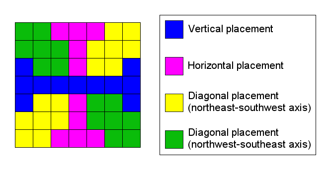
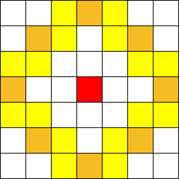
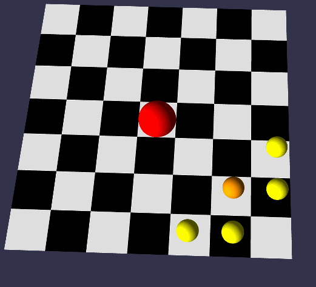
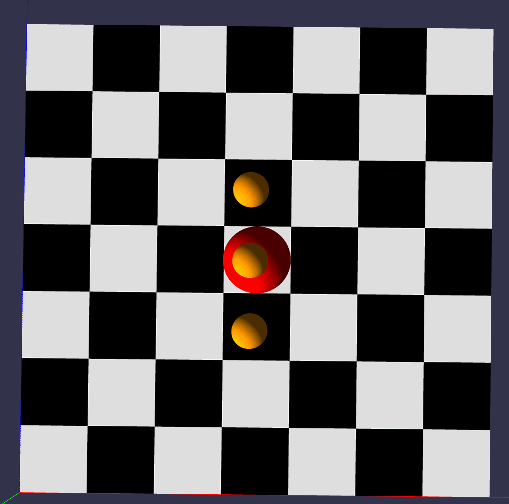

Fire Wall is a Mage spell that places several AOE triggers, which can damage and knock back enemies.

## Lifecycle

A Fire Wall consists of three segments, which are spawned when the spell is cast. These segments seem to exist as independent game actors for the duration of their lifetime. Segments will expire after a fixed time (if still "alive") determined by the skill level.

Each segment carries a number of charges (I like to think of it as "health points"), representing how many hits can be inflicted on enemies that touch the actor. Once all charges are depleted, the segment "dies" and vanishes from the game world.

As noted in [World State Updates](/game-mechanics/world-state-updates#server-tick-rate), the clock speed of the server determines how fast charges can be consumed by enemy hits.

## Placement Logic

The placement depends on the direction and length of the displacement vector from caster to target location:

Assuming the player stands in the center, the color indicates how segments are placed when cast on the given square:

- Casting horizontally or vertically results in a horizontal (or vertical) Fire Wall
- If cast on the player itself, the result is _always_ a vertical Fire Wall, with its center placed on top of them
- Casting diagonally results in a Fire Wall that's perpendicular to the direction that the player is facing

When cast at a distance, the created Fire Walls usually face "outward" from the player (here represented by the red square):

In the game world, this might look something like this (orange = cast location, red = player):

By comparison, a "vertical self-cast" would spawn segments in the following pattern:

## Knockback Effect

Enemies that touch a segment will be damaged and knocked back. **TBD: In which direction exactly?**

Since Boss monsters cannot be knocked back, they must fully "consume" the segment before they can pass through.

## References

- [Fire Wall placement in the Hercules emulator](https://github.com/HerculesWS/Hercules/blob/491048ac5a21a3ec3c114a1cfbdee3e6c00fa44e/src/map/skill.c#L21074-L21105)
- [irowiki entry](https://irowiki.org/wiki/Fire_Wall) (contains additional information that isn't yet verified)
