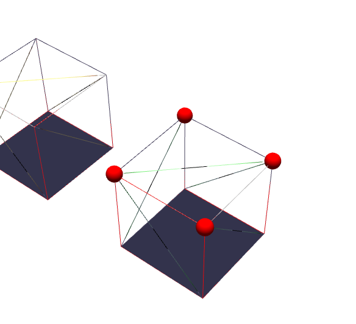
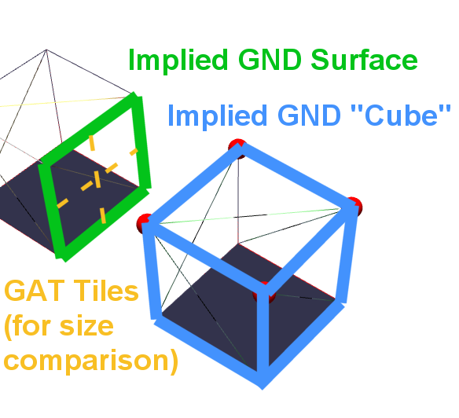
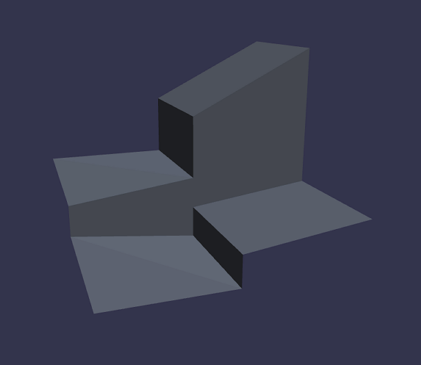
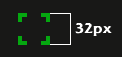
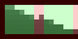

This document describes how static terrain can be reconstructed from the GND files used by the Ragnarok Online client.

## Static Map Geometry

The ground mesh is a static object that represents the terrain (or "ground") of each map. It's the defining part of the GND file and consists chiefly of geometry to which diffuse textures, color highlights and lightmap textures are applied. This forms the basis of the visual rendition of the game world, onto which ingame actors, effects, and 3D models can be placed.

## Relationship between GAT and GND

Both files correspond to different parts of a map's geometry. See also the following quote:

> What you can take away from the RO method, is that they actually use two heightmaps: one invisible heightmap used for collision detection, and a visible one used to draw the map. That way, they can extend the "invisible wall or platforms" around various objects (eg those boats or docks placed in the scene that are not part of the heightmap

_Source: [Game Development @ StackExchange](https://gamedev.stackexchange.com/questions/25823/how-to-create-a-3d-world-with-2d-sprites-similar-to-ragnorak-online)_

The "collision map" is basically the contents of the GAT file (terrain types and "walkable" flags), while the "height map" is chiefly equivalent to the ground mesh as defined by its height vectors. The server needs to have the GAT information but doesn't care about GND, while the client uses GAT information to place units at their correct height and GND files to render the terrain itself.

## Ground Mesh Reconstruction

Recreating the terrain involves a complex set of operations; It's stored in a memory-efficient format and therefore not directly compatible with how modern rendering hardware expects 3D objects to be described (see [Face-Vertex Mesh](https://en.wikipedia.org/wiki/Polygon_mesh#Face-vertex_meshes)).

Instead of storing the vertex data directly, individual chunks of terrain ("cubes") are implicitly described by "height values" that represent the upwards-facing surface geometry as relative position of its corners, offset by the surface cube's position in an imaginary "grid" of cubes. To better visualize how the geometry can be reconstructed, it might be helpful to view the terrain as a combination of different (simpler) primitive shapes, which can be "stitched together" to form the ground mesh.

### Tiles, Cubes, and Surfaces

[RO uses tiles as the basic unit of measurement for game logic](/rendering/coordinate-systems#world-coordinates), but its world actually consists of surfaces larger than that, which are part of what you could call "cubes" (boxes). These boxes are combined like a jigsaw puzzle to form the actual terrain.

Cubes are defined by only three surfaces:

- `TOP`: Flat or sloped `GROUND` surface that faces "upwards" if flat, or partially so if angled
- `NORTH`: `WALL` surface adjacent to the cube's `GROUND` and the neighboring (to the north) cube's `GROUND` surface
- `EAST`: `WALL` surface adjacent to the cube's `GROUND` and the neighboring (to the east) cube's `GROUND` surface

In order to create walls to the `BOTTOM`, `SOUTH` and `WEST`, the adjacent cube's `TOP`, `NORTH` and `EAST` surface are used, respectively.

The only two types of surfaces are `GROUND` and `WALL`, where `GROUND` is essentially the square defined by connecting the four height vectors stored in the GND file, and walls are the implied surfaces formed by connecting the `GROUND` surface of one cube to the `GROUND` surface of the neighboring cube, forming a wall where they differ in height.

The distinction between `GROUND` and `WALL` surfaces is mostly for illustration purposes; all surfaces are defined by four vertices.

Each surface of a cube is 2x2 [GAT](/file-formats/gat) tiles large and may be textured or not. Surfaces without textures (i.e., texture ID is `-1`) aren't rendered, nor can they be used to attach "wall" surfaces to from their adjacent cube. This is relevant, because in at least two instances, namely `c_tower4` and `juperos_01`, ground surfaces on the map boundaries are erroneously assigned `EAST` and `NORTH` surfaces, but you can't render walls on map boundaries since there's no vertices that they could connect with.

Surfaces/cubes are combined by "inflating" the flattened cubes in a predefined order (bottom/left to top/right, with new rows starting whenever the "map width" has been exceeded - very much like pixels in a bitmap image). This allows for efficiently reconstructing the ground mesh in a single pass, which is likely to be why the [GND](/file-formats/gnd) format looks the way it does.

Here's an illustration of the above concepts:



_Points defined by GND height vectors implicitly describe an inflated "cube"._

These then have to be turned into an equivalent representation of the actual geometry:



_Any surfaces and cubes that are implicitly defined by the height vectors can easily be reconstructed._

As mentioned above, each surface takes up the space of a two-by-two square of GAT tiles. Wall surfaces may span a larger area, but they'll appear stretched if the textures mapped to them haven't been adjusted, as can be seen in maps like `schg_dun01`.

It's worth keeping in mind that the "cubes" don't have to be literal boxes. Slopes can easily be created by adjusting the heights:



_Varying the height values assigned to individual corners allows building sloped terrain._

#### Tiles

As previously mentioned, [tiles](https://en.wikipedia.org/wiki/Tile) are the basic building block for the terrain, so in a way RO could be described as a [tile-based game](https://en.wikipedia.org/wiki/Tile-based_game). It's not technically accurate, but that's definitely how the end result is perceived. Characters are positioned (at the center) on a tile, map coordinates refer to the tile and everything that requires thinking about positions usually works with the tile as the smallest unit... except when it comes to rendering.

In practical terms, the actual size of each tile, as rendered on the screen, depends on the scale of the world, camera zoom level and screen resolution. However, it's the baseline for measuring distance in the world coordinate system, where one unit of distance can be expressed in "number of tiles".

As far as textures are concerned, a texture appears to fit on a single tile if its dimensions are 32 pixels, as can easily be seen by checking the size of the "grid selector" texture rendered on top of the currently selected tile:



For more details, see [Rendering/Coordinate Systems](/rendering/coordinate-systems).

#### Surfaces

Surfaces are larger, visible areas "containing" tiles. The entirety of the map's geometry is made out of surfaces, which can be textured or "invisible". Each surface contains exactly four tiles (two in each dimension).

This is mostly relevant for texturing, since texture slices usually are 64 pixels wide, so larger surfaces that appear seamless in the game are frequently pieced together by individual surfaces to give the appearance of a continuous textured plane. Surfaces don't fit perfectly, which is why there are visible "gaps" in the terrain that can be seen at the right camera angle and distance.

The vertices forming the terrain's surface geometry must be connected from **bottom-right to top-left** for each textured surface. If done the other way around some slopes will turn out to look rather misshapen.

#### Cubes

Generally speaking, the terrain is defined by a heightmap indicating the positions of all four corners for any given tile. Each chunk of the terrain (2x2 tiles) is sometimes called cube, which implies the presence of up to 6 surfaces: Two for the top and bottom of the cube, two to either side, and two to the front and back, where of course any number of them could be missing.

Now, the reason the cube metaphor doesn't work perfectly is that each chunk is only defined by _three_ surfaces at most: Top, north, and east. If interpreted as surfaces it doesn't really change anything; Since you can express a cube's left (or south)-facing side as the adjacent cube's right (or north)-facing side you get the same effect with a much leaner data structure.

In the GND files, you'll merely find each corner's height and the scale factor, which is enough to render the geometry. You could do this by translating the positions to world coordinates and normalize the heights so they refer to a cube of width and height 1, or just make the cubes bigger to account for the scale factor and then "zoom out" farther to get the same perspective.

The geometry is then rendered by simply glueing all the surfaces together, and walls are implicitly formed by two tiles that aren't on the same height: If there's a height difference, put a plane in between the two tiles; this becomes a "wall" if assigning it a texture. However, this is only done if the neighbouring "corners" are higher (or lower) and has a textured surface of its own.

### The Normalizing Scale Factor

The scale of the world, in relation to normalized [world coordinates](/rendering/coordinate-systems#world-coordinates), is one of the variable fields in later versions of the [GND](/file-formats/gnd) format, but turns out to be a fixed constant in practice. It always takes on the value `10`, which corresponds to "10 world units per GND cube" and "5 world units per GAT tile", respectively. The actual calculation appears to be as follows:

```javascript
normalizingScaleFactor =
  (GND.mapDimensions / GAT.mapDimensions) * GND.geometryScaleFactor;
```

Since each GND surface always measures two GAT tiles, and the scale factor is seemingly always set to ten, this nets:

```javascript
normalizingScaleFactor = 1/2 * 10 = 1/5
```

Therefore a constant scale factor of `1/5` should be correct for every map. Applying this factor scales the heights given by the height vectors of the GND file back to the standard coordinate system, with one tile being one world unit large.

## Lightmaps

Dynamic light sources are present in each map's RSW file. In order to improve rendering performance on devices of the time, the game actually doesn't use these directly. Instead, it looks like the scene lighting is precomputed from these light sources, and rendered to a texture - a process which is called baking. The GND file for each map contains the resulting bitmaps:

- A lightmap texture, frequently called "colormap", for colored lighting
- An ambient occlusion texture, frequently called "shadowmap", for shadows

Lightmaps add static light and shadow detail to each map, without requiring the client to calculate lighting in real time.

Similarly to the terrain's surface itself, the lightmap texture is sliced into unique parts, and each part must be mapped to the right surface on the assembled ground mesh. Which lightmap "slice" to map to the given terrain surface is defined by an implicit process of performing lookups in the following order: `GND cube -> GND surface -> lightmap slice -> pixel data (RGBA)`

The process for mapping slices to surfaces is therefore similar to how the actual terrain is formed: Each surface references a slice of the lightmap texture, as well as a part of the regular (diffuse) texture, while each cube references up to three surfaces.

The ambient occlusion values are stored in the same format as specularity values, with "white" pixels representing areas where no ambient occlusion (i.e., no "shadows") should be rendered. Lightmaps themselves don't have transparency values.

### Ambient Occlusion ("Shadows")

It bears repeating that there isn't a single lightmap texture, but rather two: A "color map" that contains static lighting, and a "shadow map" that contains only greyscale data and is used to render shadows. The latter effectively stores the [ambient occlusion](https://en.wikipedia.org/wiki/Ambient_occlusion) percentage for each pixel.

The "shadow map" must be applied after the lighting calculation to avoid having it blended in with the other light sources, which would cause shadows to appear "washed out" or even invisible, depending on when in the lighting process the colors are multiplied with the shadow/alpha values.

### Buffer Areas and Texture Bleeding

There's one more issue that has clearly affected the design of the lightmap format: Texture bleeding. If all the tiny slices were to be combined seamlessly, there could be visible artifacts from texture bleeding as soon as linear filtering is enabled.

To avoid this problem, a one-pixel area at the outside of each texture slice is present, which isn't used directly. It serves to provide a buffer between the adjacent slices and removes or at least reduces the effect when texture filtering is applied.

In this image you can see how two adjacent slices might be merged:



The green area marks the visible portion of each slice that is contained within the area defined by the texture coordinates, with the area outside being the "buffer" that's blended with its adjacent texels when texture bleeding occurs.

### Posterization Effect

The client reduces the number of colors when processing the lightmap texture, causing visible artifacts. These aren't part of the lightmap itself, but rather introduced deliberately when loading the texture - presumably for stylistic reasons.

The effect is achieved by applying the following operation to the RGB values:

>

```c
    r = (int)(r / LEVEL_COUNT) * LEVEL_COUNT
    g = (int)(g / LEVEL_COUNT) * LEVEL_COUNT
    b = (int)(b / LEVEL_COUNT) * LEVEL_COUNT
```

> In RO, LEVEL_COUNT is 16. For javascript it would be

```javascript
c = floor(c / LEVEL_COUNT) * LEVEL_COUNT;
```

    > where c is each color component

_Source: greenboxal (Hercules/rathena forums)_

This effectively reduces the amount of visible colors, thereby introducing the "jagged" transitions in the color gradient.

## Color Highlights (Vertex Colors)

In order to give highlights to the terrain without requiring vast amounts of ever-so slightly different textures, the client can render specific (solid) colors at the corners of each tile to give this corner (and all adjacent ones) a different hue:

> Each tile can have a diffuse color. This color, however, is not being applied to all four corners of a tile, but only to the bottom left vertex and all vertices that share the same coordinate.

Source: [Shinryo, as posted on the rAthena forums](https://rathena.org/board/topic/57955-custom-ragnarok-online-client/)

This concept is known as [vertex colors](https://gamedev.stackexchange.com/questions/139059/what-is-a-vertex-color) and it works by submitting additional information for a given vertex, which is then used by the graphics hardware to color it differently. It was widely used in older games where dynamic lighting wasn't feasible due to technical limitations, and it can have a significant visual impact for barely any effort at all.

This vertex color should be applied to the bottom left corner (vertex) of each tile and the vertices of all adjacent tiles that happen to be in the same position. With this, one can define colored spots for all corners of the tile grid with little overhead.

## References

- [An intuitive explanation of the terrain in RO](http://web.archive.org/web/20071015031008/http://www.neatocool.com/Projects/Ragnarok/Map_Editors_Text/) (archived; the screenshots are unfortunately missing)
- [This online demo](https://playground.babylonjs.com/#J48BT5#2) showing GND-style cube geometry defined in a standardized vertex data format
