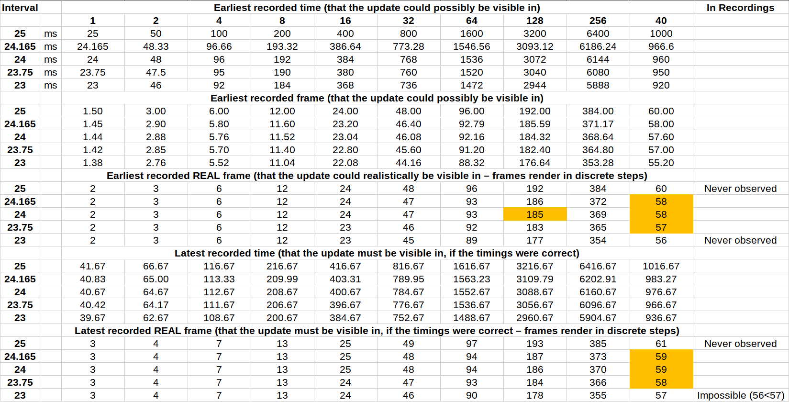
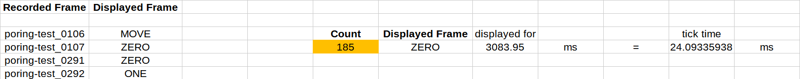

This document describes the different animation systems used in the Ragnarok Online client

## Sprite Animations

In this context, "sprite animations" refers to the animations generated from data stored in [ACT](/file-formats/act) and [SPR](/file-formats/spr) files.

### ACT Frame Times

One curiosity is the animation delay stored in the [ACT](/file-formats/act) files. While other files may provide animation times in the unit of "frames" (assuming a stable frame rate of 60 FPS), or milliseconds, ACT delays don't inherently make sense in a vacuum.

Traditionally, tools and third-party implementations have computed the ACT frame duration as follows:

```js
FrameDisplayTimeInMilliseconds = AnimationClip.FrameTimeInIntervals * 25;
```

Before diving into the accuracy of this estimate (_spoiler alert - it's slightly off_), some questions immediately spring to mind:

- Why is the frame time given in "intervals" (as ACT editor calls them) in the first place?
- Where does the 25 ms time value that has so far been used by the community actually come from? [^1]
- Is it at all correct, and is there a way to precisely measure sprite animation times to verify/disprove this?

The following sections attempt to answer these questions, as far as is realistically possible.

[^1]: The earliest known source appears to be [an earlier specification of the ACT format](https://web.archive.org/web/20200220130616/http://mist.in/gratia/ro/spr/ActFileFormatFix.html), which indicates a tool called actOR

### Animation State Updates

In order to answer the first question, a bit of guesswork is needed. There's of course no way of telling for sure why this peculiar unit of measurement was chosen by the game's developers. But knowing a bit about the different animation systems in the client, a likely explanation is that sprite animations use a different mechanism altogether (e.g., clock-based state machines).

If one assumes the existence of one or several timers that update the animation state machines, operating at a fixed clock speed, it wouldn't be as far-fetched to describe frame display times in terms of full cycles on this clock. In fact, there is some evidence that other systems (e.g., particles) do indeed involve such self-clocking mechanisms to compute their own time deltas.

This might seem like a peculiar design choice compared to a global delta time (the "standard" approach). However, it's clear that there are several different animation systems working to animate objects such as the Granny3D models, water surfaces, particle systems, and RSM(2) models[^2]. In light of this, adding one more for sprites to the mix doesn't seem particularly strange.

[^2]: This is obvious since they all use different units of measurement; Also, GR2 models were added much later in development.

### Predicting Animation Times

Allowing for the above assumptions, it's possible to explain why intervals where chosen as the unit of measurement for ACT animations. However, the exact time value is yet to be determined. While the origin of the 25 ms interval time appears to be lost to history, the number is probably an estimate based on recording frame times. But - as far as I can tell - _it's subtly wrong_.

In order to accurately compute the most likely time value, and confirm or disprove the hypothesis that it's 25 ms, one might:

- Mathematically model the expected animation duration for different clock speeds, in both milliseconds and frames
- Take into account the variance introduced by discrete rendering steps (it's not possible to render partial frames, after all)
- Record animation cycles at different speeds and sample the observed frame durations at various clock interval times
- Compare the observed frame counts per animation clip to the predicted results, accounting for measurement error

This allows progressively eliminating impossible times until the range of possible interval times narrows in on a value.

### Observed Frame Durations

Let's get the conclusion out of the way first: Based on my experiments, the real interval time is actually **24 ms**.

Showing why 25 ms can't be right involves a little bit of math to predict possible frame times over time. The idea being:

- If the real time was exactly 25 ms (which is the hypothesis to test), then observations must always lie within ~1 frame
- Even with a rendering delay greater than one frame, it would be equal for all ACT interval counts (assuming a stable 60 FPS)
- However, should the time be wrong, this error will accumulate, becoming more pronounced at higher interval counts

If the prediction is off but very close, this might be invisible in a 100 ms animation sequence (same rendered frame). But when the same sequence is stretched out to last several seconds, the error should be amplified greatly and eventually become observable. When a tiny difference (such as 1 ms per interval) is added up repeatedly, it soon amounts to multiple frames.

And indeed, this is precisely what happens. The orange boxes highlight the discrepancy between predicted and observed times:



While analyzing recordings and comparing observed frame times to the predictions, a few things quickly become clear:

- The 25ms duration appears accurate at first glance, e.g., when recording a Poring's IDLE animation at normal speed
- However, this is almost certainly a happy coincidence and due to falling within the same rendered frame (~16.667 ms)
- Increasing the interval count to even just 40 leads to recordings "missing" frames that should exist, if 25 ms was correct
- At this count, the range can be narrowed down to `(23.75, 24.165)` purely based on the number of observed frames
- It can be seen that the predicted frame times diverge ever further from the observed ones as higher values are used

In fact, the range of possible clock interval times narrows in on exactly 24 ms as the overall display duration increases:



At the above interval count of 128, the difference between both models is significant; this can no longer be explained by mere variance - or even measurement errors. What's more, the predicted frame time matches the observed time almost exactly if _and only if_ the real period is actually 24 ms (and not 25). Therefore, the animation system must be working with 24 ms intervals.

_NOTE: If you want to reproduce these results, you can find all of the relevant files [here](https://valkyrie-realm.net/research/file-formats/act/frame-times/), alongside some rudimentary usage instructions._
