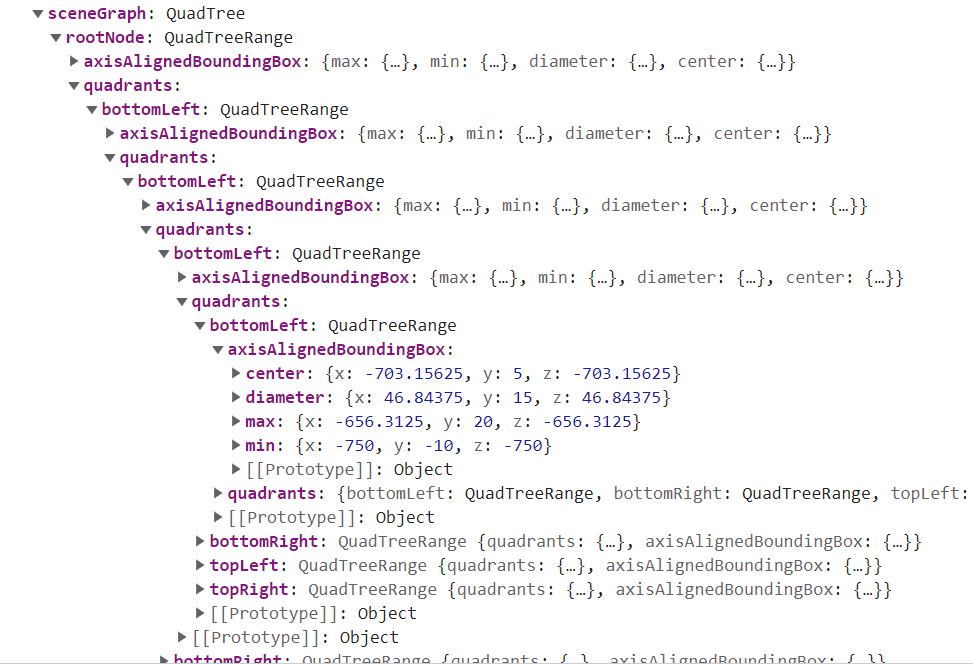

## Scene Graph Quadtrees

RSW files contain (in later versions) a data structure for efficient intersection checks, the so-called [scene graph](/file-formats/rsw#scene-graph-quadtree).

Here's an example of how this might look:

_It's ~~turtles~~ quadtrees all the way down... until reaching the leaf nodes, that is._
