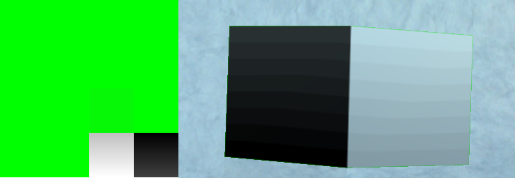
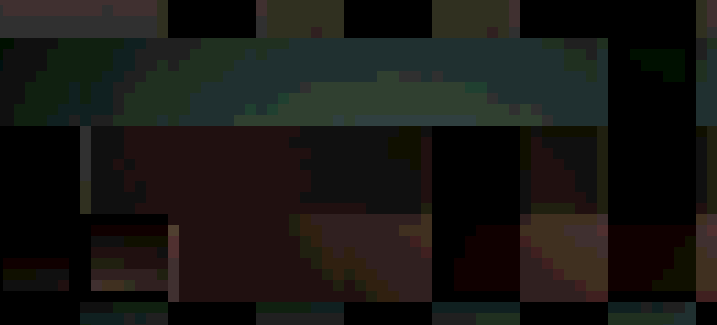

This document describes the lighting model used by the Ragnarok Online client.

## Overview

Several inputs contribute to the final color sent to the display device:

- The geometry itself defines the initial [vertex color](https://gamedev.stackexchange.com/questions/139059/what-is-a-vertex-color) for each textured surface, as well as a [vertex normal](https://en.wikipedia.org/wiki/Vertex_normal)
- One global [ambient light source](https://en.wikipedia.org/wiki/Shading#Ambient_lighting) can be configured, which controls the general "brightness" level of the scene
- A single [directional light source](https://en.wikipedia.org/wiki/Shading#Directional_lighting) is always present; it can be thought of as "the sun", casting shadows onto the map
- [Diffuse textures](https://en.wikipedia.org/wiki/Texture_mapping) (also known as color maps) add detail to the geometry, or even 2D objects like sprites and effects
- Dynamic light sources, here stored in precomputed [lightmap textures](https://en.wikipedia.org/wiki/Lightmap), additionally contribute to the lighting
- If enabled, the engine's [vertex fog effect](https://learn.microsoft.com/en-us/windows/win32/direct3d9/vertex-fog#range-based-fog) will be used to apply color-grading according to the fog parameters

The following sections explain how an accurate rendition of the game world can be produced from all of the above.

## Pipeline Stages

Not all objects in the world are affected by light equally. This can be expressed in terms of [fixed-function pipeline](https://en.wikipedia.org/wiki/Fixed-function) stages:

| Object Type | Lighting | Diffuse Texture Blending | Lightmap Texture Blending | Vertex Fog | Alpha Blending |
| :---------: | :------: | :----------------------: | :-----------------------: | :--------: | :------------: |
|   Ground    |   YES    |           YES            |            YES            |    YES     |       NO       |
|    Water    |    NO    |           YES            |            NO             |    YES     |      YES       |

The list is currently incomplete; more research is needed on the remaining object types. Some educated guesses:

- Models: Diffuse, lighting, vertex fog, alpha blend stages are enabled - lightmap contribution is TBD
- Sprites: Diffuse, vertex fog, alpha blend stages are likely enabled - lightmap contribution is TBD
- UI widgets: Diffuse, alpha blend stages are likely enabled - everything else is probably disabled

There may be other game objects that use different settings, but these should be the most important ones.

## Input Variables

The operations performed as part of a given pipeline stage may depend on various inputs:

- The base color is always interpolated from the fragment's vertex color and defaults to black, i.e., `rgb(0, 0, 0)`
- To increase the vibrancy of colors, both ambient and directional light colors must be [screen blended](https://en.wikipedia.org/wiki/Blend_modes#Screen) with the base color
- Next, the total light contribution can be computed using the directional and ambient light's setting and the vertex normal
- Diffuse textures are modulated (multiplied) with the result of the previous stage, presumably while ignoring alpha?
- The alpha channel of the lightmap texture ("shadowmap") is first modulated with the result of the previous stage
- Afterwards, the RGB channel of the lightmap texture ("color map") is added on top of this result, and possibly clamped?
- Vertex fog contributes its color based on the distance from the vertex to the camera's viewpoint, linearly interpolated
- Finally, the generated fragment may be layered on top (via [alpha compositing](https://en.wikipedia.org/wiki/Alpha_compositing)) in accordance with the selected blend mode

How those operations are implemented depends on the graphics API. DirectX7 uses [render states](https://learn.microsoft.com/en-us/windows/win32/direct3d9/render-states) and [blending stages](https://learn.microsoft.com/en-us/windows/win32/direct3d9/creating-blending-stages).

## Lighting Stage

Computes the lit base color, corrected for [underexposure](https://www.adobe.com/creativecloud/photography/hub/guides/underexposure-vs-overexposure-photography.html) that's being introduced due to working in the wrong color space.

Inputs:

- Directional light settings from the map's [RSW](/file-formats/rsw) file
- Ambient light settings from the map's [RSW](/file-formats/rsw) file
- Vertex color and surface normals derived from the [GND](/file-formats/gnd), [RSM](/file-formats/rsm), or [GR2](/file-formats/gr2) file

Operations:

1. Compute sunlight contribution from the directional light settings
1. Add ambient light contribution from the ambient light settings
1. Clamp result to the unit range (in order to avoid overexposure)
1. Compute contrast correction color using [Screen](https://affinityspotlight.com/article/blend-modes-explained/) blending
1. Modulate the previous result with the contrast correction color

Specular highlights are disabled and needn't be added.

### Directional Light

The ray direction of the sun can be calculated from its world position, stored as [spherical coordinates](https://en.wikipedia.org/wiki/Spherical_coordinate_system) in the [RSW](/file-formats/rsw) file:

```lua
function RagnarokRSW:ComputeSunRayDirection(latitudeInDegrees, longitudeInDegrees)
	local sunRayDirection = Vector3D(0, -1, 0)

	local rotationAroundX = Matrix3D:CreateAxisRotationX(-latitudeInDegrees) -- Account for inverted Y
	local rotationAroundY = Matrix3D:CreateAxisRotationY(longitudeInDegrees)

	sunRayDirection:Transform(rotationAroundX)
	sunRayDirection:Transform(rotationAroundY)

	return sunRayDirection
end
```

_Source: Example implementation taken from the [RagLite SDK](https://github.com/RagnarokResearchLab/RagLite/blob/0bc2856e2acebcbb568b095853180574a78dc4ba/Core/FileFormats/RagnarokRSW.lua#L246-L256) (based on previous work by [Borf](https://github.com/Borf) and [FlavioJS](https://github.com/flaviojs/))_

### Ambient Light

If lightmaps are disabled, the ambient scene lighting is amplified by a factor of 50% (multiply color components by 1.5).

This serves as an optional "brightness correction" step that only takes place when lightmaps are disabled on load.

### Dynamic Lights

The [RSW](/file-formats/rsw) file of each map contains definitions for the dynamic light sources in the scene. However, they aren't rendered by the client in real time. Instead, the game uses pre-computed [lightmap](https://en.wikipedia.org/wiki/Lightmap) textures which can be blended with the terrain geometry more efficiently at runtime. Since the lights don't directly contribute to the scene lighting, I won't discuss them in detail here.

If you're interested in how they can be used for dynamic lighting, you should check out [Doddler's explanation on YouTube](https://youtu.be/VKywJ0QtcFE?t=561).

### Contrast Correction

When rendering the scene with just the ambient and directional light sources contributing alongside the diffuse or lightmap textures, the resulting image is severly underexposed. This is likely because lighting computations were performed in the wrong color space, prompting the developers to layer a composite blending effect on top to make the colors more vibrant.

For more information, see the [Wikipedia article on blend modes](https://en.wikipedia.org/wiki/Blend_modes), in particular the section about composite [screen blending](https://en.wikipedia.org/wiki/Blend_modes#Screen).

### Object Lighting

Scene objects (i.e., RSM model instances) may receive additional lighting when lightmap textures are enabled. The client includes a file called `mapobjlighttable.txt` that looks like it would be used to control this behavior. However, this mechanism seems to be broken or unused. More research is needed to determine how objects should be lit when the feature is enabled.

Examples: According to said table, object lighting is **enabled** for`orcsdun01` and `orcsdun02`, but **disabled** for `gef_dun0`.

## Texture Blending Stages

Projects textures onto the lit geometry (as computed during the lighting stage) in order to cheaply add more detail.

### Diffuse Textures

Diffuse textures don't use the alpha channel directly, but rather adopt a convention where magenta becomes transparent:

```rust
fn isTransparentBackgroundPixel(diffuseTextureColor : vec4f) -> bool {
	return (diffuseTextureColor.r >= 254.0/255.0
	&& diffuseTextureColor.g <= 3.0/255.0
	&& diffuseTextureColor.b >= 254.0/255.0);
}
```

_Example: A method to determine which background pixels to discard based on the RGBA value (originally proposed by [curiosity](https://github.com/curio-r))_

This enables the use of simple 256 color bitmaps (stored in [BMP files](https://en.wikipedia.org/wiki/BMP_file_format)) for mostly every texture, at the cost of flexibility.

Additionally, texture images are degraded by what appears to be a reduction in [color depth](https://en.wikipedia.org/wiki/Color_depth) to 16 bits per pixel:



_Pictured: The use of a smooth gradient demonstrates how textures are rendered with fewer colors inside the game_

This quantization step is the cause of [color banding](https://en.wikipedia.org/wiki/Colour_banding), which explains the [posterization](https://en.wikipedia.org/wiki/Posterization) effect that can be observed on lightmaps.

### Lightmap Textures

Lightmap textures affect only the terrain ([ground mesh](/rendering/ground-mesh)) directly. Scene decorations may be lit separately (see [Object Lighting](#object-lighting)).

Said alpha channel encodes the [ambient occlusion](https://en.wikipedia.org/wiki/Ambient_occlusion) percentage, while the RGB channel encodes the light contribution of the [dynamic light sources](#dynamic-lights) that were used to bake the lightmap texture. Colors lose even more precision due to the alpha channel:



_Pictured: The banding effect introduced by downsampling lightmaps to 4 bits per channel can immediately be spotted_

Each lightmap texture slices include a buffer area (1 pixel wide) that's designed to soften the impact of [texture bleeding](https://gamedev.stackexchange.com/questions/111704/getting-rid-of-texture-bleeding).

## Vertex Fogging Stage

Adds a basic color grading effect to any scene that uses the effect - if there's no fog this is effectively a NOOP.

### Fog Parameters

The GRF archive includes a list of [fog parameters](https://learn.microsoft.com/en-us/windows/win32/direct3d9/fog-parameters) (`fogParameterTable.txt`), which controls the [range-based vertex fog effect](https://learn.microsoft.com/en-us/windows/win32/direct3d9/vertex-fog#range-based-fog).

This database contains one entry for each map that should use the fog effect. All entries have the following format:

```txt
map_id#
nearLimitPercentage#
farLimitPercentage#
fogColorARGB#
unusedDensityPercentage#
```

As an example, consider the fog settings for Payon Cave F0 (`pay_dun00`):

```txt
pay_dun00.rsw#
0.1#
0.9#
0xff04009A#
0.3#
```

This tells the DirectX engine to apply a vertex fog effect using color `rgb(4, 0, 154)` ([alpha is ignored](https://learn.microsoft.com/en-us/windows/win32/direct3d9/fog-color)) that reaches its highest density level at a distance of `1490 * 0.9 = 1341` world units (`268.2` if normalized) and is the least dense at a distance of `1490 * 0.1 = 149` world units (`29.8` if normalized), where the size of the imagined "fog sphere" is determined by the delta between the camera's near and far planes: `farPlaneDistance - nearPlaneDistance` resulting in `1500 - 10 = 1490` - see [Camera Controls](/rendering/camera-controls/#perspective-projection).

The density parameter is completely ignored as it's used for [exponential mode](https://learn.microsoft.com/en-us/windows/win32/direct3d9/fog-formulas#exponential-fog), but the game only uses [linear fog.](https://learn.microsoft.com/en-us/windows/win32/direct3d9/fog-formulas#linear-fog).

## Alpha Composition Stage

Whenever transparency effects are used, this is the stage that actually computes the result.

### Blending Equations

Alpha blending may be performed to render translucent objects on top of the existing scenery (i.e., the game world). This process is highly specific to the type of object being rendered, but much more research is needed to cover the various 2D effects, sprites, etc. So far only the method for rendering water surfaces can be stated here with a high degree of certainty:

- General blend formula: `RGBAsrc × RGBAsrcFactor + RGBAdst × RGBAdstFactor` (using [WebGPU](https://gpuweb.github.io/gpuweb/#blend-state) terminology)
- Color components: `RGBAsrc × SrcAlpha + RGBAdst × OneMinusSrcAlpha`
- Alpha component: `RGBAsrc × One + RGBAdst × OneMinusSrcAlpha`

Perhaps unsurprisingly, this is the standard **A over B** operator described in the [Wikipedia article on alpha compositing](https://en.wikipedia.org/wiki/Alpha_compositing).

### Supported Blend Modes

The following table contains the blend parameters for all blend modes that have been verified so far:

| Object Type | Component | Source Factor | Destination Factor | Blend Operation |
| :---------: | :-------: | :-----------: | :----------------: | :-------------: |
| Water Plane |   Color   |  `SrcAlpha`   | `OneMinusSrcAlpha` |      `Add`      |
| Water Plane |   Alpha   |     `One`     | `OneMinusSrcAlpha` |      `Add`      |

Here, `Source` is the object to be blended (e.g., the water surface) and `Destination` refers to the existing frame buffer contents.

## A Note on Color Spaces

Lighting computations are usually performed on linear colors, even if most output devices expect the result in [sRGB](https://en.wikipedia.org/wiki/SRGB) format.

Since textures generally store colors in sRGB format, they need to be gamma-decompressed before use as the result will otherwise be a severely underexposed image. Afterwards, colors would then be sRGB-encoded again before the device can actually display them. This step is called [gamma correction](https://en.wikipedia.org/wiki/Gamma_correction) and intended to emulate the characteristics of [CRT monitors](https://en.wikipedia.org/wiki/Cathode-ray_tube).

The RO client, however, doesn't seem to be doing any of this. Instead, the sRGB-encoded textures are seemingly used as-is. The lighting computations then fundamentally alter the appearance of the rendered scene by introducing underexposure into the final image, so that darker regions appear more intense. This is alleviated by the [tone mapping step](/rendering/scene-lighting#contrast-correction) added via screen blending.

[This blog post](https://blog.johnnovak.net/2016/09/21/what-every-coder-should-know-about-gamma/) explains the issue in more detail. With the screen blending effect there's no need to perform gamma correction.

## References

- [OpenGL-specific tutorial that explains gamma correction](https://lettier.github.io/3d-game-shaders-for-beginners/gamma-correction.html)
- [Another OpenGL-based explanation of the gamma correction issue](https://learnopengl.com/Advanced-Lighting/Gamma-Correction)
- [Tutorial explaining the use of the Screen blend mode in Photoshop](https://www.photoshopessentials.com/photo-editing/layer-blend-modes/screen/)
- [Implementation of the lighting model - for terrain surfaces only - in WebGPU Shader Language (WGSL)](https://github.com/RagnarokResearchLab/RagLite/blob/0bc2856e2acebcbb568b095853180574a78dc4ba/Core/NativeClient/WebGPU/Shaders/TerrainGeometryShader.wgsl#L138-L171)
